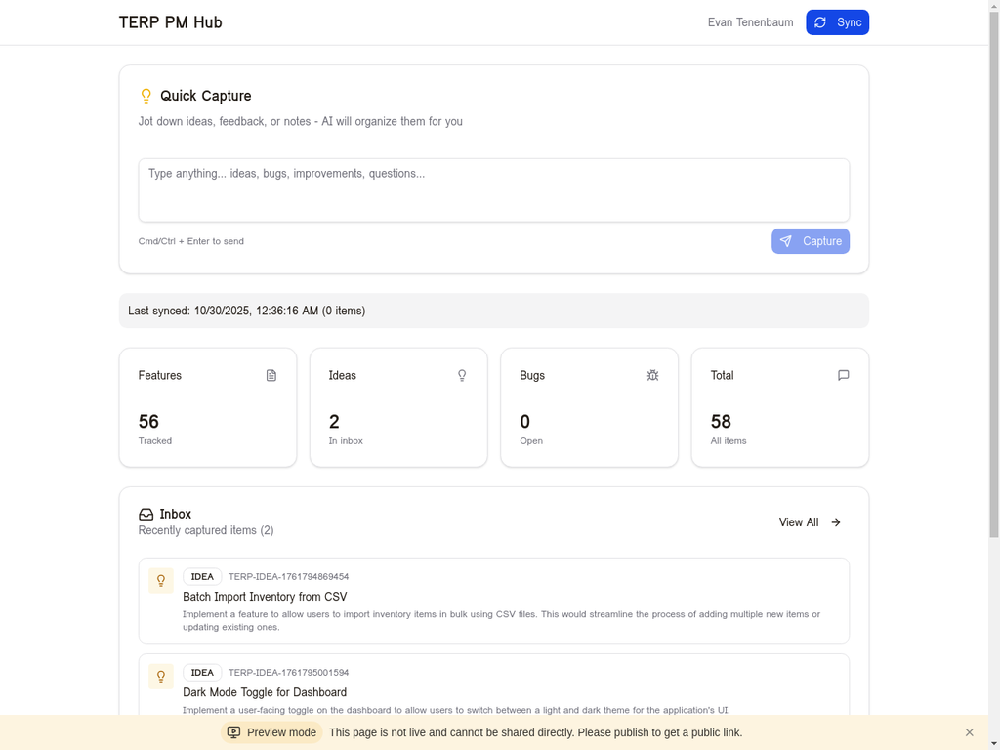
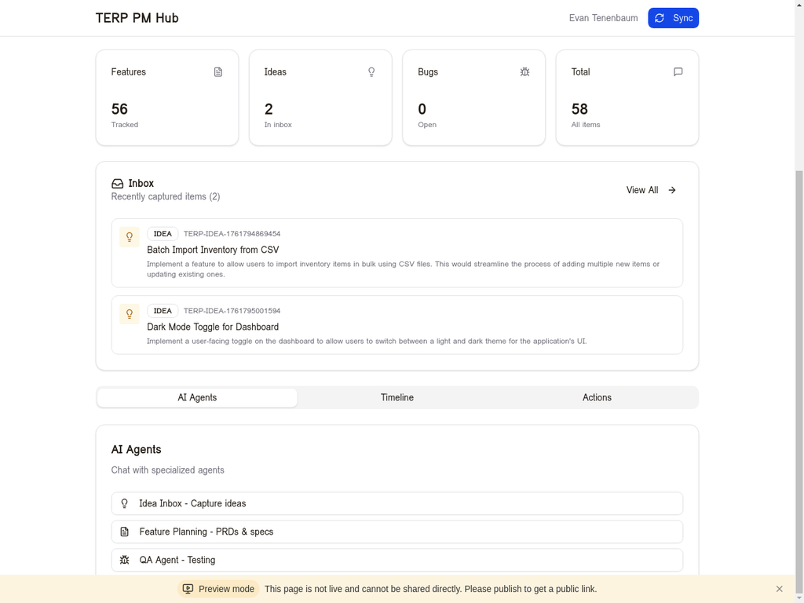
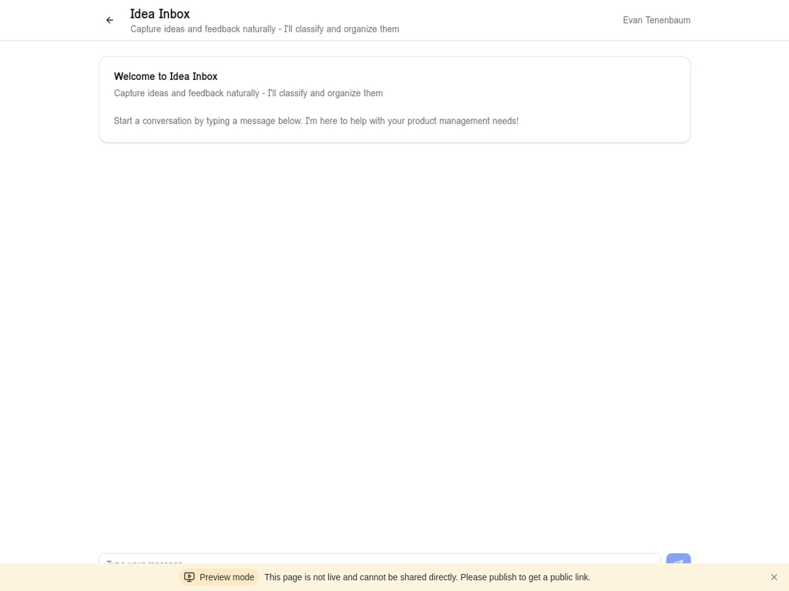
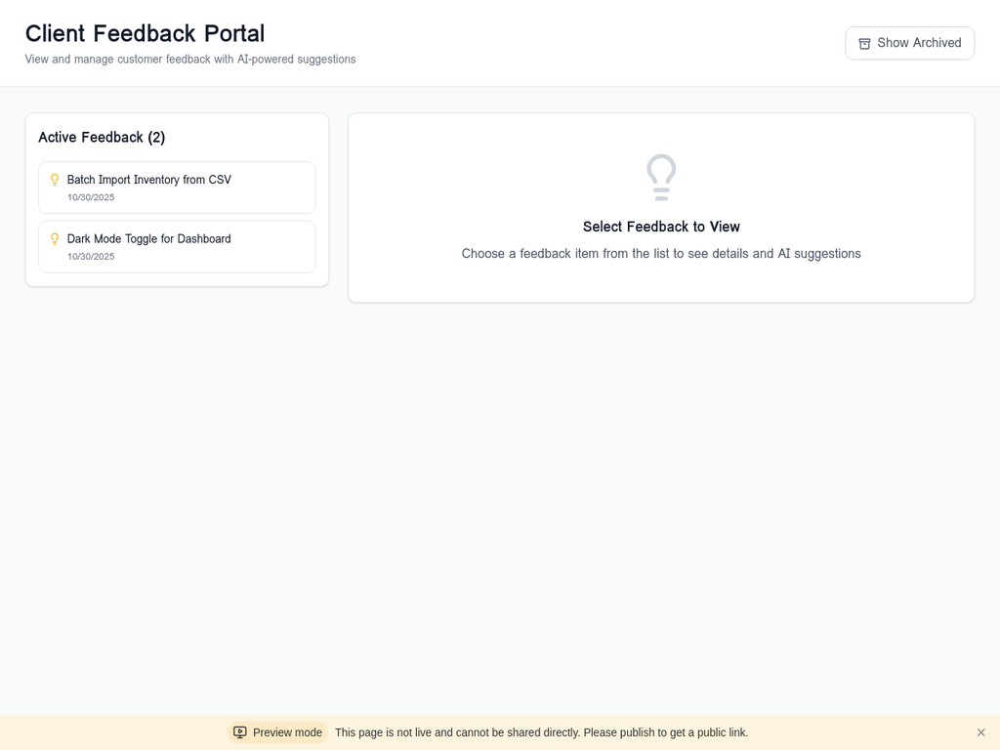
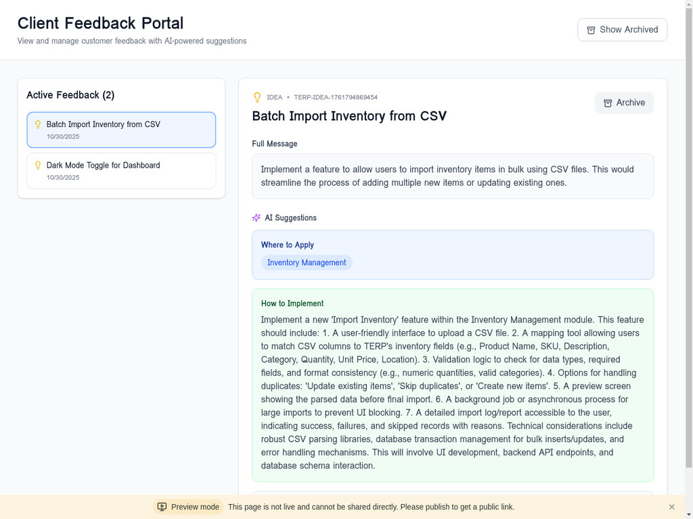
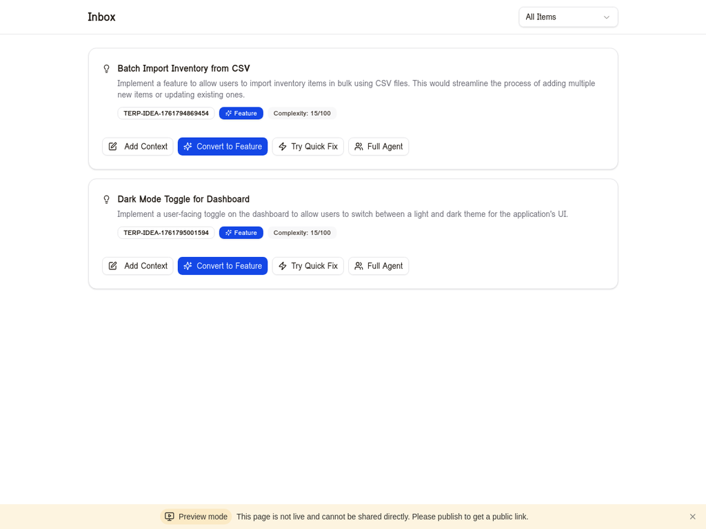

# TERP PM Hub - Complete Training Guide

**Version:** 1.0  
**Date:** October 29, 2025  
**For:** Product Managers, Development Teams, Stakeholders

---

## Table of Contents

1. [Introduction](#introduction)
2. [Getting Started](#getting-started)
3. [Quick Capture - Your Idea Inbox](#quick-capture)
4. [AI Agents - Your PM Assistants](#ai-agents)
5. [Client Feedback Portal](#client-feedback-portal)
6. [Feature Management](#feature-management)
7. [Inbox & Triage System](#inbox-triage)
8. [Command Palette (Cmd+K)](#command-palette)
9. [GitHub Integration](#github-integration)
10. [Export & Reporting](#export-reporting)
11. [Best Practices](#best-practices)
12. [Troubleshooting](#troubleshooting)

---

## 1. Introduction {#introduction}

TERP PM Hub is an AI-powered product management platform that helps you capture ideas, manage features, and collaborate with AI agents to streamline your workflow. The system integrates with GitHub to keep your product management data synchronized with your codebase.

### Key Features

The platform provides a comprehensive suite of tools designed to enhance productivity and collaboration. At its core, the **Quick Capture** feature allows you to jot down ideas, feedback, or notes instantly, with AI automatically organizing and classifying them for you. The system includes four specialized **AI Agents** that assist with different aspects of product management: the Idea Inbox agent captures and classifies ideas, the Feature Planning agent helps write PRDs and specifications, the QA Agent generates test cases and quality assurance strategies, and the Codebase Expert provides technical insights and code analysis.

For client-facing needs, the **Client Feedback Portal** offers a dedicated interface where customers can submit feedback, which is then enhanced with AI-powered suggestions indicating where to apply the feedback and how to implement it. The **Feature Management** system provides full CRUD operations for features, ideas, and bugs, complete with tags, priorities, dependencies, and status tracking. The **Smart Triage** functionality includes complexity analysis and AI-powered recommendations for handling each item, whether through quick fixes, full agent development, or manual implementation.

Additional capabilities include **GitHub Sync** for automatic bidirectional synchronization with your GitHub repository, **Export** functionality supporting CSV, Markdown, and JSON formats, **Bulk Actions** for efficient multi-item updates, and a **Command Palette** accessible via Cmd+K for quick navigation and actions. The platform also features a **Timeline Visualization** that displays feature dependencies and milestones, along with an **Activity Feed** tracking recent changes and updates across the system.

### Who Should Use This Guide

This guide is designed for Product Managers who capture requirements and manage the product backlog, Development Teams who need to understand feature specifications and dependencies, QA Engineers who write test cases and validate features, Stakeholders who review progress and provide feedback, and Clients who submit feedback through the dedicated portal.

---

## 2. Getting Started {#getting-started}

### Accessing the Platform

To begin using TERP PM Hub, navigate to your deployment URL in a web browser. The platform supports Chrome, Firefox, Safari, and Edge browsers. You will need to sign in using your organizational credentials through the OAuth portal. Once authenticated, you will land on the Dashboard, which serves as your central hub for all product management activities.

### Dashboard Overview

The Dashboard is organized into several key sections that provide a comprehensive view of your product management landscape. The **Quick Capture** area sits prominently at the top, offering a textarea where you can type ideas, bugs, or improvements. Simply press Cmd/Ctrl + Enter to send your input, and AI will automatically classify and organize it for you.

Below Quick Capture, you will find **Stats Cards** displaying real-time metrics: the number of Features being tracked, Ideas in your inbox, open Bugs, and the Total count of all items. The **Sync Status** indicator shows when the last GitHub synchronization occurred and how many items were synced, giving you confidence that your data is up to date.

The **Inbox Section** displays recently captured items, providing quick access to the latest feedback and ideas. Each item shows its type (IDEA, FEAT, BUG), ID, title, and description. You can click "View All" to navigate to the full Inbox page for more detailed management.

At the bottom of the Dashboard, you will find three tabs: **AI Agents** for accessing specialized chat assistants, **Timeline** for visualizing feature dependencies and milestones, and **Actions** for quick access to common operations like exporting data or triggering manual syncs.

---

## 3. Quick Capture - Your Idea Inbox {#quick-capture}

### How It Works

Quick Capture is your fastest way to get ideas into the system without interrupting your flow. The AI-powered classification system automatically determines whether your input is an idea, feature request, bug report, or improvement suggestion. It extracts key information such as title, description, and priority, then creates a properly formatted PM item in the database.

### Using Quick Capture

To use Quick Capture, start by clicking into the textarea on the Dashboard. Type your thought naturally - you do not need to format it or categorize it. For example, you might write: "We need a dark mode toggle for the dashboard" or "Users are reporting slow load times on the Features page" or "Add CSV import for batch inventory updates."

Once you have entered your text, press Cmd/Ctrl + Enter to submit, or click the "Capture" button. The AI will process your input within seconds, and you will see a confirmation that your item has been captured. The item will appear in the Inbox section below, and you can click on it to view details or take action.

### Best Practices

For optimal results, be specific about what you want or what problem you are solving. Include context when relevant, such as "for mobile users" or "in the accounting module." You can capture multiple ideas quickly - just submit one, then immediately type the next. The system is designed for rapid input without friction.

Do not worry about formatting or categorization - the AI handles that automatically. If you need to add more context later, you can always edit the item in the Inbox page. The goal is to capture the idea while it is fresh, then refine it later if needed.

---

## 4. AI Agents - Your PM Assistants {#ai-agents}

### Overview

TERP PM Hub includes four specialized AI agents, each designed to assist with specific product management tasks. These agents have access to your project context, including existing features, codebase structure, and development protocols, allowing them to provide informed, actionable guidance.

### Idea Inbox Agent

The Idea Inbox agent is your first point of contact for capturing and classifying ideas. When you chat with this agent, it interprets your natural language input and creates structured PM items automatically. For example, you might say "We should add a batch import feature for inventory" and the agent will respond with a confirmation, then create a new IDEA item with a proper title, description, type classification, and suggested priority.

To use the Idea Inbox agent, click "Idea Inbox - Capture ideas" from the AI Agents section on the Dashboard. Type your idea naturally in the chat input at the bottom of the screen. The agent will ask clarifying questions if needed, such as "Which module should this apply to?" or "Is this high priority?" Once the conversation is complete, the agent creates the PM item and provides you with the item ID for reference.

### Feature Planning Agent

The Feature Planning agent helps you write comprehensive Product Requirements Documents (PRDs) and technical specifications. This agent is particularly useful when you need to flesh out a feature idea into a detailed specification that developers can implement.

To use the Feature Planning agent, click "Feature Planning - PRDs & specs" from the AI Agents section. Describe the feature you want to plan, for example: "Help me write a PRD for the batch import feature." The agent will generate a structured PRD including an overview, user stories, acceptance criteria, technical considerations, dependencies, and success metrics. You can ask follow-up questions to refine the specification, and the agent will update the document accordingly.

### QA Agent

The QA Agent specializes in testing strategy and test case generation. When you are preparing to QA a feature, this agent can help you identify edge cases, write comprehensive test scenarios, and ensure you have not missed any critical testing areas.

To use the QA Agent, click "QA Agent - Testing" from the AI Agents section. Describe the feature you need to test, for example: "What test cases should I write for the CSV import feature?" The agent will provide a comprehensive testing strategy including functional tests (happy path, error handling, edge cases), performance tests (large file handling, concurrent uploads), security tests (file validation, injection prevention), and usability tests (user feedback, error messages).

### Codebase Expert

The Codebase Expert has deep knowledge of your TERP codebase structure and can answer technical questions, suggest implementation approaches, and identify potential issues. This agent is particularly useful for developers who need context about existing code or architectural decisions.

To use the Codebase Expert, click "Codebase Expert" from the AI Agents section. Ask technical questions like "How is the pricing calculation implemented?" or "What's the best way to add a new module?" The agent will provide code-level insights, point you to relevant files, and suggest implementation patterns that align with your existing architecture.

### Tips for Working with AI Agents

For the best results when working with AI agents, be specific in your questions and provide context when relevant. Do not hesitate to ask follow-up questions to clarify or expand on the agent's responses. You can copy and paste the agent's output into your documentation or issue tracker for reference. Remember that agents have access to your project context, so they can provide tailored advice specific to TERP.

---

## 5. Client Feedback Portal {#client-feedback-portal}

### Overview

The Client Feedback Portal is a dedicated interface at `/feedback` where customers can submit feedback and you can review it with AI-powered insights. This portal is designed to be client-friendly, avoiding PM jargon and presenting information in a clear, accessible format.

### Viewing Feedback

When you navigate to the Feedback Portal, you will see a list of active feedback items on the left side of the screen. Each item displays an icon indicating its type (lightbulb for ideas, bug icon for issues), the title of the feedback, and the submission date. Items are color-coded for easy visual scanning: blue for ideas, red for bugs, and purple for improvements.

To view details for a specific feedback item, click on it in the list. The right panel will display the full message, showing exactly what the customer submitted. Below the message, you will find the AI Suggestions section, which provides intelligent recommendations for handling the feedback.

### AI-Powered Suggestions

The AI Suggestions feature is one of the most powerful aspects of the Feedback Portal. When you select a feedback item, you can click "Generate Suggestions" to get AI-powered insights. The system analyzes the feedback and provides two key pieces of information.

First, the **"Where to Apply"** section identifies which modules or areas of the application should be updated based on the feedback. For example, if a customer requests a CSV import feature, the AI will suggest "Inventory Management" as the target module. This helps you quickly route the feedback to the right team or development area.

Second, the **"How to Implement"** section provides a detailed, actionable implementation plan. This includes step-by-step guidance on what needs to be built, technical considerations, and potential challenges. For the CSV import example, the AI might suggest creating a user-friendly upload interface, implementing column mapping, adding validation logic, providing a preview screen, and setting up background job processing.

Finally, the **Confidence Score** indicates how confident the AI is in its suggestions, displayed as a percentage with a visual progress bar. A score of 95% means the AI is highly confident in its recommendations, while a lower score might indicate that the feedback is ambiguous or requires human judgment.

### Managing Feedback

Once you have reviewed feedback and generated suggestions, you have several options for managing it. You can click the **Archive** button to move the feedback to the archived state, removing it from the active list while preserving it for historical reference. To view archived feedback, toggle the "Show Archived" button in the top-right corner of the portal.

You can also export feedback data for reporting or analysis, or integrate the suggestions into your feature planning process by copying the AI's recommendations into a PRD or development brief.

### Best Practices for Feedback Management

To get the most value from the Feedback Portal, review new feedback regularly - ideally daily or weekly depending on submission volume. Always generate AI suggestions before making decisions, as they can reveal insights you might have missed. Use the confidence score as a guide, but apply your own judgment for critical decisions. Archive feedback promptly after addressing it to keep the active list focused and manageable. Finally, share AI suggestions with your development team to ensure everyone understands the context and implementation approach.

---

## 6. Feature Management {#feature-management}

### Viewing All Features

To access the complete list of features, ideas, and bugs, navigate to the Features page by clicking on the navigation menu or using the Command Palette (Cmd+K and type "features"). The Features page displays all PM items in a card-based layout, with each card showing the item type, status, ID, title, description, and action buttons.

### Filtering and Searching

The Features page includes powerful filtering and search capabilities to help you find exactly what you are looking for. The **Search Bar** at the top allows you to search by title, description, or ID - just start typing and results filter in real-time. The **Status Filter** dropdown lets you filter by status (Inbox, Backlog, Planned, In Progress, Completed, On Hold, Archived), making it easy to focus on items in a specific state.

### Editing Features

To edit a feature, click the "Edit" button on any feature card. This opens the Edit Feature Modal, which provides access to all editable fields. You can update the **Title** to change the feature name, modify the **Description** to add or refine details, change the **Status** to reflect current progress (Inbox → Backlog → Planned → In Progress → Completed), adjust the **Priority** (Low, Medium, High, Critical), and manage **Tags** by adding or removing tags for categorization and filtering.

The modal also allows you to edit **Dependencies**, specifying which other features must be completed first, and update the **GitHub Path** if the feature is linked to a specific file or directory in your repository. Once you have made your changes, click "Save Changes" to update the feature. The system will validate your input and show a success notification when the update is complete.

### Bulk Actions

When you need to update multiple items at once, use the Bulk Actions feature. Start by clicking the checkbox on each feature card you want to modify - you will see a selection count appear at the top of the page. Once you have selected your items, click the "Bulk Actions" button to open the bulk operations menu.

You can perform several operations on selected items: **Update Status** to move multiple items to a new status simultaneously, **Update Priority** to change priority for all selected items, **Add Tags** to apply tags to multiple items at once, or **Delete** to remove multiple items (with confirmation prompt). After selecting your action, confirm the operation, and the system will update all selected items in a single transaction.

### Exporting Data

The Export feature allows you to download your PM data in various formats for reporting, backup, or integration with other tools. Click the "Export" button at the top of the Features page, then choose your desired format: **CSV** for spreadsheet analysis in Excel or Google Sheets, **Markdown** for documentation or wiki integration, or **JSON** for programmatic access or API integration.

The export includes all visible items based on your current filters, so you can filter first, then export to get exactly the data you need. The file will download automatically to your browser's download folder.

---

## 7. Inbox & Triage System {#inbox-triage}

### Overview

The Inbox page is your command center for triaging captured ideas and feedback. Every item captured through Quick Capture or submitted via the Feedback Portal appears here, ready for you to review and take action.

### Inbox Layout

The Inbox displays items in a list format, with each item showing its icon and type (IDEA, FEAT, BUG), title and description, item ID for reference, complexity score (calculated by AI), and action buttons for next steps. Items are sorted by capture date, with the most recent at the top.

### Complexity Analysis

Each inbox item includes an AI-generated complexity score that helps you understand how difficult it will be to implement. The score is displayed as a fraction, for example "Complexity: 15/100" where lower numbers indicate simpler tasks and higher numbers indicate more complex features.

The complexity analysis considers several factors: the number of modules or components affected, technical difficulty and required expertise, dependencies on other features or systems, estimated development time, and potential risks or unknowns. This score helps you make informed decisions about how to handle each item.

### Action Options

For each inbox item, you have four action options that guide you toward the most appropriate next step.

**Add Context** allows you to open a modal where you can add additional notes, links, or attachments to the item. This is useful when you need to capture more information before making a decision, such as customer quotes, mockups, or technical research.

**Convert to Feature** transforms the inbox item into a full-fledged feature with proper status, priority, and tracking. This is the right choice for ideas that you have validated and want to add to your backlog. The system will prompt you to set the initial status and priority.

**Try Quick Fix** is for simple, low-complexity items that can be handled with a quick code generation or minor change. The system will analyze the item and, if appropriate, generate code snippets or configuration changes that a developer can apply immediately.

**Full Agent** launches a comprehensive Manus development agent that will handle the entire implementation from start to finish. This is best for medium to high complexity features that require multiple files, database changes, or architectural decisions. The agent will create a development brief, generate code, run tests, and provide a complete implementation.

### Triage Workflow

An effective triage workflow follows these steps. First, review new items daily to keep the inbox manageable and ensure nothing falls through the cracks. Second, read the description and complexity score to understand what is being requested and how difficult it will be. Third, add context if you need more information before deciding - do not hesitate to ask clarifying questions or gather additional requirements.

Fourth, make a decision based on the complexity score and your priorities: for complexity under 20, use "Try Quick Fix" for rapid implementation; for complexity 20-50, use "Convert to Feature" and add to backlog; for complexity over 50, use "Full Agent" for comprehensive development; and for items that are not actionable or out of scope, archive them with a note explaining why.

Finally, clear your inbox regularly by moving items to the appropriate next stage. An empty inbox means you have triaged everything and made decisions - it is a sign of good PM hygiene.

---

## 8. Command Palette (Cmd+K) {#command-palette}

### Accessing the Command Palette

Press **Cmd+K** (Mac) or **Ctrl+K** (Windows/Linux) from anywhere in the application to open the Command Palette. This is the fastest way to navigate and take actions without using your mouse.

### Search and Navigation

The Command Palette provides instant search across all your PM items. Start typing to search by title, ID, or description, and results appear in real-time. Press Enter to navigate to the selected item, or use arrow keys to navigate the results list.

### Quick Actions

The Command Palette also supports quick actions through keyword commands. Type "export" to access export options, "sync" to trigger a manual GitHub sync, "new feature" to create a new feature item, or "inbox" to navigate to the Inbox page. The palette learns your usage patterns and will surface frequently used actions at the top of the list.

---

## 9. GitHub Integration {#github-integration}

### How It Works

TERP PM Hub maintains bidirectional synchronization with your GitHub repository. PM items are stored as markdown files in the `product-management/` directory, organized by type (features, ideas, bugs) and status (inbox, backlog, planned, in-progress, completed, on-hold, archived).

### Manual Sync

To trigger a manual sync, click the "Sync" button in the top-right corner of the Dashboard. The button will show a spinning icon while the sync is in progress. Once complete, you will see a success notification and the "Last synced" timestamp will update.

The sync process fetches all markdown files from the GitHub repository, parses them into PM items, updates the database with any changes from GitHub, pushes any local changes back to GitHub, and handles conflicts by preferring the most recently updated version.

### Auto-Sync

The system automatically syncs with GitHub once per browser session when you first load the Dashboard. After the initial sync, it will sync again every 5 minutes in the background to keep data fresh. You can also trigger a manual sync at any time if you know changes have been made in GitHub.

### Viewing on GitHub

Each feature card includes a "View on GitHub" link that takes you directly to the markdown file in your repository. This is useful when you want to see the raw file, view the commit history, or make edits directly in GitHub.

---

## 10. Export & Reporting {#export-reporting}

### Export Formats

The Export feature supports three formats, each optimized for different use cases.

**CSV (Comma-Separated Values)** is ideal for spreadsheet analysis in Excel or Google Sheets. It includes all fields as columns (ID, Title, Description, Status, Priority, Tags, Created Date, Updated Date) and can be easily filtered, sorted, and analyzed using pivot tables or formulas.

**Markdown** is perfect for documentation or wiki integration. It generates a formatted markdown document with headers, lists, and links that can be pasted directly into Confluence, Notion, or GitHub wikis. The format is human-readable and preserves formatting.

**JSON (JavaScript Object Notation)** is designed for programmatic access or API integration. It provides the raw data structure that can be consumed by scripts, imported into other tools, or used for backup and restore operations.

### Filtering Before Export

To export a subset of your data, apply filters on the Features page before clicking Export. For example, you might filter by status "In Progress" to export only active work items, filter by priority "High" or "Critical" to export urgent items, or filter by tags to export items in a specific category or module. The export will include only the items that match your current filters, giving you precise control over what data is exported.

### Use Cases

Common use cases for exporting data include weekly status reports for stakeholders, backlog reviews with your development team, quarterly planning sessions where you need to analyze trends, backup and archival for compliance or historical reference, and integration with external tools like JIRA, Asana, or Linear.

---

## 11. Best Practices {#best-practices}

### Daily Workflow

An effective daily workflow with TERP PM Hub starts each morning by opening the Dashboard and reviewing the Inbox section for new items captured overnight or by team members. Use Quick Capture throughout the day to jot down ideas as they come to you - do not let good ideas slip away because you were in a meeting or focused on something else.

At the end of each day, spend 10-15 minutes triaging your inbox. Review each item, add context if needed, and move items to the appropriate next stage (Quick Fix, Convert to Feature, or Full Agent). This daily discipline keeps your inbox manageable and ensures nothing falls through the cracks.

### Weekly Workflow

Once per week, typically on Monday morning or Friday afternoon, review your entire backlog on the Features page. Update statuses for items that have progressed, adjust priorities based on new information or changing business needs, and add or remove tags to keep categorization accurate.

Export a status report in Markdown or CSV format to share with stakeholders, providing visibility into what has been completed, what is in progress, and what is planned. Sync with GitHub manually to ensure all changes are pushed and pulled, even though auto-sync handles most of this automatically.

### Monthly Workflow

On a monthly basis, conduct a comprehensive review of completed features to celebrate wins and identify patterns. Analyze trends in your inbox - are certain types of requests increasing? Are there recurring themes that suggest a larger strategic initiative? Archive old items that are no longer relevant to keep your active dataset focused and manageable.

Review AI suggestions for accuracy and usefulness. If you notice the AI is consistently missing the mark on certain types of feedback, consider providing more context in your descriptions or adjusting your categorization approach.

### Collaboration Tips

When working with a team, establish clear ownership by assigning features to specific team members using tags or custom fields. Use consistent tagging conventions across your team to ensure everyone categorizes items the same way. Share AI agent outputs in team channels to spark discussion and alignment - the agents can provide valuable starting points for conversations.

Encourage your team to use Quick Capture liberally - it is better to capture too much than to lose good ideas. The triage process will filter out what is not actionable. Finally, review the Feedback Portal together as a team during sprint planning or backlog grooming sessions to ensure customer voice is heard and incorporated into your roadmap.

---

## 12. Troubleshooting {#troubleshooting}

### Common Issues

**Issue: Quick Capture is not working**

If Quick Capture is not responding, first check that you are signed in by verifying your name appears in the top-right corner. Ensure you are pressing Cmd/Ctrl + Enter to submit, or clicking the "Capture" button. Try refreshing the page if the textarea is unresponsive. If the problem persists, check the browser console for errors (F12 → Console tab) and report any error messages to your system administrator.

**Issue: GitHub sync is failing**

If GitHub sync is failing, verify that your GitHub token is configured correctly in the system settings. Check that the repository path is correct and that you have write access to the `product-management/` directory. Look for error messages in the sync status notification - common issues include rate limiting (wait a few minutes and try again) or network connectivity problems. If you see 404 errors for missing directories, the system will handle these gracefully, but you may need to create the directory structure manually in GitHub.

**Issue: AI suggestions are not generating**

If AI suggestions are not generating in the Feedback Portal, ensure you have clicked the "Generate Suggestions" button and waited for the AI to process (this can take 5-10 seconds). Check your internet connection, as AI processing requires an active connection to the backend. If you see an error message, try refreshing the page and attempting again. If the problem persists, the AI service may be temporarily unavailable - check with your system administrator.

**Issue: Search is not returning results**

If search is not returning expected results, verify your spelling and try broader search terms. Remember that search looks in title, description, and ID fields - if you are searching for a tag, use the tag filter instead. Clear any active status filters that might be hiding results. Try using the Command Palette (Cmd+K) as an alternative search interface.

**Issue: Export is not downloading**

If export is not downloading files, check your browser's download settings and ensure downloads are not blocked. Look for a download notification in your browser's address bar or bottom corner. Try a different export format to see if the issue is format-specific. If you are on a corporate network, check that file downloads are allowed by your firewall or proxy.

### Getting Help

If you encounter an issue not covered in this guide, first check the browser console (F12 → Console) for error messages that might provide clues. Take a screenshot of the issue, including any error messages, and note the steps you took that led to the problem. Contact your system administrator or PM Hub support team with this information.

For feature requests or suggestions to improve the platform, use Quick Capture to submit your idea - the PM Hub team uses the same system to manage the platform's own development!

---

## Appendix: Keyboard Shortcuts

- **Cmd/Ctrl + K**: Open Command Palette
- **Cmd/Ctrl + Enter**: Submit Quick Capture
- **Esc**: Close modals or Command Palette
- **Arrow Keys**: Navigate Command Palette results
- **Enter**: Select Command Palette result

---

## Appendix: Item Types

- **IDEA**: Raw ideas or suggestions that need validation
- **FEAT**: Validated features added to the backlog
- **BUG**: Issues or defects that need fixing
- **IMPROVE**: Enhancements to existing features
- **TECH**: Technical debt or infrastructure work

---

## Appendix: Status Workflow

The typical status progression for a PM item follows this path:

1. **Inbox**: Newly captured, needs triage
2. **Backlog**: Validated and prioritized, not yet planned
3. **Planned**: Scheduled for upcoming sprint or release
4. **In Progress**: Actively being developed
5. **Completed**: Implementation finished and deployed
6. **On Hold**: Paused due to dependencies or changing priorities
7. **Archived**: No longer relevant or superseded by other work

---

**End of Training Guide**

For additional support or questions, contact your PM Hub administrator or visit the internal documentation wiki.
